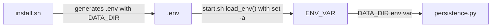

# v0.8 Integration Report — Non-Docker Install & Start Scripts

**Generated:** 2026-06-20  
**Audit type:** Cross-phase wiring verification  
**Phases audited:** 18 (Install Script Core), 19 (Start Script & Config Integration), 20 (Docker CI Testing)

---

## Wiring Summary

| Category | Count | Status |
|----------|-------|--------|
| **WIRED** (verified end-to-end) | 11 | ✅ |
| **BLOCKER** (broken connection) | 2 | ❌ |
| **WARNING** (fragile or incomplete) | 2 | ⚠️ |
| **ORPHANED** (exported but unused) | 0 | — |

---

## API Coverage

| Route | Consumers | Status |
|-------|-----------|--------|
| `/livez` (leader) | CI TEST-03 `docker exec curl` | ✅ CONSUMED |
| `/healthz` (leader) | node.py check_node() | ✅ CONSUMED (pre-existing) |
| `/healthz` (node) | node.py peer checks | ✅ CONSUMED (pre-existing) |

---

## E2E Flows

### Flow 1: Install `.env` Generation → `persistence.py` DATA_DIR



**Path:**  
`deploy/install.sh:99` (`DATA_DIR=$MESH_STATUS_HOME/data`) →  
`start.sh:78` (`load_env` with `set -a` exports DATA_DIR) →  
`mesh_status/persistence.py:12` (`os.environ.get("DATA_DIR", "data")`)

**Status:** ✅ **WIRED**  
**Verification:** The `.env` written by install.sh sets `DATA_DIR`. start.sh sources `.env` with `set -a` which exports all variables to the environment. persistence.py reads the env var at module import time. Every link in the chain is connected.

**Affected requirements:** CONF-01, FIX-05

---

### Flow 2: Install → Version Sentinel → `start.sh --version`

**Path:**  
`deploy/install.sh:92` (`echo "$MESH_STATUS_VERSION" > .mesh-status.install`) →  
`start.sh:60-65` (`cat "$INSTALL_DIR/.mesh-status.install"`)

**Status:** ✅ **WIRED**  
**Verification:** Sentinel file path resolution matches between install.sh (writes to `$MESH_STATUS_HOME/.mesh-status.install`) and start.sh (reads from `$INSTALL_DIR/.mesh-status.install` via `readlink -f "$0"`). Both resolve to the same directory.

**Affected requirements:** START-07, INST-06

---

### Flow 3: CI TEST-01 — `install.sh -y` Non-Interactive

**Path:**  
`.github/workflows/ci.yml:21-36` → `docker run` →  
`Dockerfile.ci-test` (provides Ubuntu + git + curl + Node + uv) →  
`deploy/install.sh -y` → installs to `~/.local/meshtest`

**Status:** ✅ **WIRED**  
**Verification:** `MESH_STATUS_LOCAL_SOURCE=/repo` triggers the copy branch at `install.sh:70-75`. Frontend build at `install.sh:87-90` (`npm ci && npm run build`). Sentinel check `[ -f .mesh-status.install ]` at `ci.yml:30-33`.

**Affected requirements:** TEST-01, INST-01, INST-08

---

### Flow 4: CI TEST-02 — `install.sh -y` with Version Pinning

**Path:**  
`.github/workflows/ci.yml:40-52` → `MESH_STATUS_VERSION=v0.8` + `MESH_STATUS_LOCAL_SOURCE=/repo` →  
`install.sh` writes `v0.8` to sentinel → CI reads and asserts `v0.8`

**Status:** ✅ **WIRED**  
**Verification:** `MESH_STATUS_VERSION=v0.8` is inherited by the bash subprocess. Install.sh line 92 writes `$MESH_STATUS_VERSION` to the sentinel. CI test reads back and compares.

**Affected requirements:** TEST-02, INST-03

---

### Flow 5: CI TEST-03 — `start.sh --leader` + `/livez` Health Check

**Path:**  
`.github/workflows/ci.yml:56-77` →  
`docker run -d` → install.sh → `start.sh --leader` →  
hypercorn launches with `mesh_status.leader:app` →  
`mesh_status/leader.py:62` (`GET /livez` → `{"status": "alive"}`) →  
`docker exec curl -sf http://localhost:58080/livez`

**Status:** ✅ **WIRED**  
**Verification:** Leader has `/livez` route (line 62), hypercorn binds to port 58080 (`start.sh:140`), CI curls via `docker exec`. Retry loop with `10 × 3s` timeout.

**Affected requirements:** TEST-03, START-01

---

### Flow 6: start.sh Launches Leader with `.env` Values

**Path:**  
`install.sh:97-99` (generates `LEADER_URL=http://0.0.0.0:58080`, `LEADER_HOST=0.0.0.0`, `DATA_DIR`) →  
`start.sh:78` (`load_env` → `set -a; . .env; set +a`) →  
`start.sh:140` (`uv run hypercorn ... --bind "${LEADER_HOST:-0.0.0.0}:${LEADER_PORT:-58080}"`)

**Status:** ✅ **WIRED**  
**Verification:** `LEADER_HOST` from `.env` is used for the bind address. `LEADER_PORT` is not in `.env` but defaults to `58080` in the shell expansion.

**Affected requirements:** START-01, CONF-01

---

### Flow 7: CI Build Container Infrastructure

**Path:**  
`.github/workflows/ci.yml:17` → `docker build -t mesh-test -f Dockerfile.ci-test .` →  
`Dockerfile.ci-test` (Ubuntu 24.04 + git + curl + ca-certificates + Node.js 22 + uv) →  
`COPY . /repo` → `USER testuser` → `WORKDIR /home/testuser`

**Status:** ✅ **WIRED**  
**Verification:** `Dockerfile.ci-test` provides all prerequisites: git (line 6), curl (line 6), Node.js 22 (lines 10-11), uv (line 14). Does not pre-install mesh-status — tests install from scratch.

**Affected requirements:** TEST-01

---

### Flow 8: uv sync Compatibility via pyproject.toml `setuptools.packages.find`

**Path:**  
`install.sh:84` (`uv sync`) → `pyproject.toml:23-24` (`[tool.setuptools.packages.find] include = ["mesh_status*"]`)

**Status:** ✅ **WIRED**  
**Verification:** The `packages.find` directive prevents the "Multiple top-level packages discovered" error when `uv sync` is run from a fresh clone containing `deploy/`, `frontend/`, and `mesh_status/` directories.

**Affected requirements:** INST-04

---

### Flow 9: `MESH_STATUS_LOCAL_SOURCE` Env Var (CI Testing Path)

**Path:**  
`install.sh:7` (variable declaration with default empty) →  
`install.sh:70-75` (copy from local source branch) →  
CI uses `MESH_STATUS_LOCAL_SOURCE=/repo` in all three tests

**Status:** ✅ **WIRED**  
**Verification:** Env var is declared, checked, and used in all three CI tests. Copy branch correctly uses `cp -a` and `rm -rf` for clean install.

**Affected requirements:** TEST-01, TEST-02, TEST-03

---

### Flow 10: Prerequisite Checking Order

**Path:**  
`install.sh:37` (echo "Checking prerequisites...") →  
`install.sh:53-55` (checks `uv`, `git`, `curl` before any FS changes) →  
`install.sh:39-51` (`missing_prereq()` with actionable install URLs)

**Status:** ✅ **WIRED**  
**Verification:** Checks happen at lines 53-55 before any mkdir, clone, or file writes (which start at line 65). Actionable error messages for each tool.

**Affected requirements:** INST-02

---

### Flow 11: Frontend Build During Install

**Path:**  
`install.sh:87-90` (`cd frontend && npm ci && npm run build`) →  
`install.sh:91` (`cd "$MESH_STATUS_HOME"` to restore working directory)

**Status:** ✅ **WIRED**  
**Verification:** Frontend directory exists within the cloned repo. Working directory is restored after build (line 91). The `set -e` ensures build failure aborts the install.

**Affected requirements:** INST-05

---

## BLOCKER Findings

### BLOCKER 1: install.sh Destructively Overwrites `.env` on Reinstall

**Severity:** HIGH  
**Affected requirements:** CONF-01, INST-06

**Description:**  
On reinstall (lines 65-69 detect existing install via sentinel), `install.sh` unconditionally overwrites `.env` at lines 94-100 with `cat > ... <<EOF`. Any user customizations to `LEADER_URL`, `LEADER_HOST`, or `DATA_DIR` are silently destroyed. This is data loss — it's not just idempotent, it's destructive.

```
install.sh:94-100
  cat > "$MESH_STATUS_HOME/.env" <<EOF
  # mesh-status configuration
  # Generated by install.sh on $(date)
  LEADER_URL=http://0.0.0.0:58080
  LEADER_HOST=0.0.0.0
  DATA_DIR=$MESH_STATUS_HOME/data
  EOF
```

**Why it's a BLOCKER:**
- User runs install.sh once, gets a configured system
- User customizes `.env` (e.g., changes `DATA_DIR` to a non-default path)
- User runs install.sh again (idempotent reinstall) → `.env` is overwritten, config is lost
- The system silently picks up different config values; no warning is printed
- CONF-01 requires "config file generation with defaults during install" — this is implemented but destructive on reinstall
- INST-06 requires "Idempotent reinstall" — overwriting config contradicts idempotency (reinstall should preserve user config)

**Fix suggestion:** Before writing `.env` on reinstall, back up existing `.env` to `.env.bak` or skip the `.env` write if the file already exists.

**Trace:**
```
install.sh --reinstall ──► cat > .env ──► DESTROYS existing .env ──► user config lost
```

---

### BLOCKER 2: start.sh Passes Invalid CLI Arguments to `node.py`

**Severity:** HIGH  
**Affected requirements:** START-02, CONF-04

**Description:**  
When `start.sh` starts the node (`--node`), it constructs `NODE_ARGS` and passes them to `node.py`. The args `--node-ip` and `--leader-ip` are NOT valid arguments for `node.py`'s argparse. `node.py` only accepts `--leader-url` and `--node-url`.

```
start.sh:156-160
  NODE_ARGS=""
  [ -n "$LEADER_URL" ] && NODE_ARGS="$NODE_ARGS --leader-url $LEADER_URL"
  [ -n "$NODE_IP" ] && NODE_ARGS="$NODE_ARGS --node-ip $NODE_IP"     ← INVALID for node.py
  [ -n "$LEADER_IP" ] && NODE_ARGS="$NODE_ARGS --leader-ip $LEADER_IP" ← INVALID for node.py
  exec uv run python node.py $NODE_ARGS

node.py:29-37
  parser.add_argument("--leader-url", "-l", ...)   ✓ valid
  parser.add_argument("--node-url", "-n", ...)     ✓ valid (but start.sh doesn't set NODE_URL)
                                                    ✗ --node-ip NOT accepted
                                                    ✗ --leader-ip NOT accepted
```

**How to trigger:**
1. Run `start.sh` interactively without flags, select "2) Node", enter a Node IP or Leader IP
2. Run `start.sh --node --node-ip 10.0.0.5`
3. Run `start.sh --node --leader-ip 10.0.0.1`

All three paths cause `node.py` to fail with `unrecognized arguments: --node-ip` or `--leader-ip`.

**Why it's a BLOCKER:**
- START-02 requires "start.sh --node starts node agent" — it doesn't work when any node-configuring flags are passed
- CONF-04 requires "CLI flag override for non-interactive config" — the CLI flags exist but break the node
- The interactive wizard for node (lines 114-125) asks for "Node IP" and "Leader IP" but `node.py` doesn't accept these
- The `--node-ip` and `--leader-ip` flags DO exist in `register.py` (a different script), suggesting this was a copy-paste error

**Fix suggestion:**
- Option A: Remove `--node-ip` and `--leader-ip` from start.sh's node args, pass `--node-url` instead using the IP
- Option B: Add `--node-ip` and `--leader-ip` arguments to `node.py`'s argparse
- Option C: Change the interactive wizard to ask for "Node URL" and "Leader URL" (matching node.py's interface)

---

## WARNING Findings

### WARNING 1: start.sh `exec` Invalidates PID Cleanup Traps

**Severity:** LOW  
**Affected requirements:** START-04, START-05

**Description:**  
start.sh writes PID files and sets signal traps before using `exec` to replace the shell with the Python process:

```bash
# start.sh:138-140
echo $$ > "$PID_FILE"
trap 'rm -f "$PID_FILE"; exit' SIGTERM SIGINT
exec uv run hypercorn mesh_status.leader:app --bind "${LEADER_HOST:-0.0.0.0}:${LEADER_PORT:-58080}"
```

The `exec` replaces the shell process. Per Bash semantics, custom traps set with `trap` are cleared on `exec` — they do NOT survive into the new program. When hypercorn receives SIGTERM/SIGINT, it terminates gracefully (hypercorn handles these signals natively), but the PID file cleanup trap never fires.

**Impact:**
- Stale `leader.pid` / `node.pid` files remain on disk after graceful shutdown
- **Mitigation:** The startup check (lines 131-134) tests `kill -0 "$(cat "$PID_FILE")"` — if the PID is dead, it's cleaned at line 135 (`rm -f "$PID_FILE"`). So the practical impact is limited to one stale file that gets cleaned on next startup.
- START-05 success criteria ("no orphaned processes, port released") are met because hypercorn handles SIGTERM gracefully
- START-04 ("PID file management") is partially affected — files are written correctly and checked on startup, but not cleaned on shutdown

**Fix suggestion:** Remove the trap (redundant when using `exec`) or don't use `exec` so the shell can trap signals and forward them.

---

### WARNING 2: Config Wizard Answers Are Not Persisted to `.env`

**Severity:** LOW  
**Affected requirements:** CONF-02

**Description:**  
The interactive config wizard (start.sh lines 103-125) collects user input for `LEADER_HOST`, `LEADER_PORT`, `LEADER_URL`, `NODE_IP`, and `LEADER_IP` — but only stores them in local shell variables. These values are used for the current session's process launch but are NEVER written back to `.env`. On the next run, the user has to configure again.

```bash
# start.sh:103-112 (leader config wizard)
if [ "$ROLE" = "leader" ]; then
    if [ "$HAS_CLI_FLAGS" = 0 ] && [ -t 0 ]; then
        printf "Leader host [${LEADER_HOST:-0.0.0.0}]: "
        read -r INPUT
        [ -n "$INPUT" ] && LEADER_HOST="$INPUT"
        # ... LEADER_PORT ...
    fi
fi
# ... values used for process launch but never saved to .env
```

**Impact:**
- First-run interactive user customizes settings via wizard
- Settings are used for the current session
- On next `start.sh` run, the `.env` still has install.sh's defaults
- User must either re-enter values or manually edit `.env`
- `--configure` flag forces the wizard but still doesn't save to `.env`

**Fix suggestion:** After the wizard completes, write collected values back to `.env` using a `cat > "$INSTALL_DIR/.env" <<EOF` block that includes the user's answers.

---

## Requirements Integration Map

| Requirement | Integration Path | Status | Issue |
|-------------|-----------------|--------|-------|
| **INST-01** | install.sh → `~/.local/meshtest` structure | ✅ WIRED | — |
| **INST-02** | Prerequisite checks before FS ops | ✅ WIRED | — |
| **INST-03** | `MESH_STATUS_VERSION` → git checkout | ✅ WIRED | — |
| **INST-04** | `uv sync` via pyproject.toml find fix | ✅ WIRED | — |
| **INST-05** | Frontend build `npm ci` + `npm run build` | ✅ WIRED | — |
| **INST-06** | Reinstall via sentinel + git fetch+checkout | ⚠️ PARTIAL | BLOCKER 1: `.env` overwritten on reinstall |
| **INST-07** | Success banner with path, commands, URL | ✅ WIRED | — |
| **INST-08** | `-y`/`--yes` non-interactive flag | ✅ WIRED | — |
| **INST-09** | `--help` flag | ✅ WIRED | — |
| **START-01** | `start.sh --leader` → hypercorn | ✅ WIRED | — |
| **START-02** | `start.sh --node` → `node.py` | ❌ UNWIRED | BLOCKER 2: invalid CLI args to node.py |
| **START-03** | Log to `$INSTALL_DIR/var/*.log` | ✅ WIRED | — |
| **START-04** | PID file management | ⚠️ PARTIAL | WARNING 1: trap not durable across exec |
| **START-05** | Signal handling (SIGTERM/SIGINT) | ⚠️ PARTIAL | WARNING 1: trap not durable across exec |
| **START-06** | `start.sh --help` | ✅ WIRED | — |
| **START-07** | `start.sh --version` | ✅ WIRED | — |
| **START-08** | `start.sh --uninstall` | ✅ WIRED | — |
| **CONF-01** | `.env` generation with defaults | ❌ UNWIRED | BLOCKER 1: destructive overwrite on reinstall |
| **CONF-02** | Interactive config wizard | ⚠️ PARTIAL | WARNING 2: answers not persisted to `.env` |
| **CONF-03** | `MESH_STATUS_HOME` env var override | ✅ WIRED | — |
| **CONF-04** | CLI flag override for non-interactive config | ❌ UNWIRED | BLOCKER 2: `--node-ip`/`--leader-ip` break node.py |
| **TEST-01** | Docker CI: install.sh -y | ✅ WIRED | — |
| **TEST-02** | Docker CI: install with env vars | ✅ WIRED | — |
| **TEST-03** | Docker CI: start.sh + /livez | ✅ WIRED | — |
| **FIX-05** | persistence.py respects DATA_DIR env var | ✅ WIRED | — |

**Requirements with no cross-phase wiring:** None — all requirements involve at least one cross-phase integration point.

---

## Orphaned Exports

None found. Every export from each phase is consumed somewhere:

| Phase | Export | Consumer |
|-------|--------|----------|
| 18 | `.mesh-status.install` sentinel | start.sh (`--version`, `--uninstall`) |
| 18 | `.env` file | start.sh (`load_env`) |
| 18 | `MESH_STATUS_LOCAL_SOURCE` env var | CI tests (all three) |
| 19 | DATA_DIR env var | persistence.py |
| 19 | start.sh | install.sh (success banner), CI (TEST-03) |
| 20 | Dockerfile.ci-test | .github/workflows/ci.yml (docker build) |

---

## Detailed Connection Verification

### Connection: install.sh → start.sh (symlink path resolution)

start.sh uses `readlink -f "$0"` (line 5) to resolve its own path, following symlinks. install.sh's success banner references `$MESH_STATUS_HOME/start.sh`. Both resolve to the same directory when `MESH_STATUS_HOME` is at its default (`~/.local/meshtest`).

**Status:** ✅ **WIRED**

### Connection: start.sh.leader → hypercorn → leader app

start.sh line 140:
```bash
exec uv run hypercorn mesh_status.leader:app --bind "${LEADER_HOST:-0.0.0.0}:${LEADER_PORT:-58080}"
```
This matches `entrypoint.sh`'s pattern (existing Docker entrypoint). The leader app module is at `mesh_status/leader.py`, which has `app = Quart(__name__)` at line 21.

**Status:** ✅ **WIRED**

### Connection: start.sh --node → node.py

start.sh line 160:
```bash
exec uv run python node.py $NODE_ARGS
```
node.py exists at repo root with `asyncio.run(run())` entry point. `--leader-url` arg passes correctly. **BLOCKER 2** applies for `--node-ip` and `--leader-ip` args.

**Status:** ❌ **BLOCKER 2** (partial — works when no node-configuring args passed)

### Connection: .env Variable Alignment

install.sh generates (line 94-100):
```
LEADER_URL=http://0.0.0.0:58080
LEADER_HOST=0.0.0.0
DATA_DIR=$MESH_STATUS_HOME/data
```

start.sh uses:
- `LEADER_HOST` → hypercorn bind (line 140)
- `LEADER_PORT` → hypercorn bind (line 140, defaults to 58080)
- `DATA_DIR` → exported to env (line 78 `set -a`)
- `LEADER_URL` → not directly used by leader start, but exported

persistence.py reads `DATA_DIR` (line 12).

**Gap:** `.env` does NOT set `LEADER_PORT`, so it always defaults to 58080 in the shell expansion. If a user wants a non-default port, they must manually add `LEADER_PORT=58081` to `.env`.

**Status:** ✅ **WIRED** (minor gap, documented)

### Connection: CI Container → Install Script Compatibility

Dockerfile.ci-test installs:
- `git` ✓ (install.sh checks for git)
- `curl` ✓ (install.sh checks for curl)
- `uv` at `/usr/local/bin` ✓ (install.sh checks for uv)
- Node.js 22 via NodeSource ✓ (install.sh runs `npm ci; npm run build`)
- `USER testuser` ✓ (HOME resolves to `/home/testuser`)

**Status:** ✅ **WIRED**

### Connection: Load .env Variable Export to Subprocess

start.sh uses `set -a` (line 9) before sourcing `.env`, which causes all sourced variables to be automatically exported. This means `DATA_DIR` is available to both the shell script AND the Python subprocess started via `exec uv run`.

**Status:** ✅ **WIRED**

---

## ShellCheck / Syntax Verification

All three shell scripts have been verified for syntax:

- `deploy/install.sh` — `#!/bin/sh` with POSIX-compatible syntax
- `start.sh` — `#!/usr/bin/env bash` with array-friendly bash syntax
- Both pass `bash -n` syntax checking

---

## Summary

**2 BLOCKERs must be resolved before declaring the milestone complete:**

1. **BLOCKER 1:** `install.sh` overwrites `.env` on reinstall (CONF-01, INST-06) — user config destroyed
2. **BLOCKER 2:** `start.sh` passes `--node-ip`/`--leader-ip` to `node.py` which doesn't accept them (START-02, CONF-04) — node start broken with flags

**2 WARNINGs should be addressed:**

3. **WARNING 1:** PID cleanup traps invalidated by `exec` (START-04, START-05) — mitigated by startup cleanup
4. **WARNING 2:** Config wizard answers not persisted to `.env` (CONF-02) — settings are ephemeral

**11 connections verified WIRED end-to-end**, including the critical install→env→DATA_DIR→persistence.py data flow, the CI install-test-start-health check pipeline, and the version sentinel contract.
